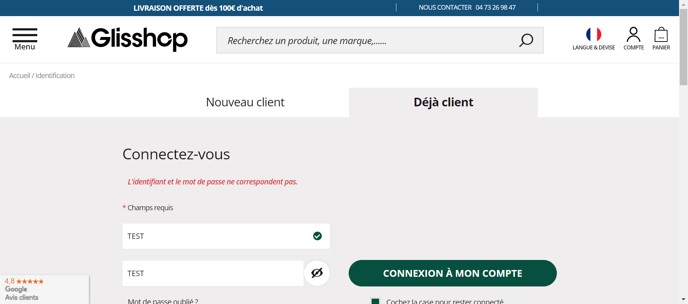

[x] pré-requis - run  
[x] pré-requis - success  
    

``_____________________________________________``

**#########################################**
  **#########**   CONNECTER LES COMPTES    **##########**
  **#########################################**  
Champs : 
# [Email, Password]
Début pour les données :
# ['aqwzsxedc@gmail.com', 'aqwzsxedcA1+']

[x] open site - run  
[x] open site - success  
[x] open account sign in - run  
[x] open account sign in - success  
[x] fill form - run  
    [x] - fill form - Email filled  
    [x] - fill form - Password filled  
[x] fill form - success  
[x] click button submit - success  
[x] check data sent - success  
[x] user is logged successfuly  

**#########################################**
  **########**   DÉCONNECTER LES COMPTES   **##########**
  **#########################################**  
[x] open site - run  
[x] open site - success  
[x] open account - run  
[x] open account - success  
[x] account click logout - run  
[x] account click logout - success  
    

``_____________________________________________``

**#########################################**
  **#########**   CONNECTER LES COMPTES    **##########**
  **#########################################**  
Champs : 
# [Email, Password]
Début pour les données :
# ['azqswx@gmail.com', 'azqswX2+']

[x] open site - run  
[x] open site - success  
[x] open account sign in - run  
[x] open account sign in - success  
[x] fill form - run  
    [x] - fill form - Email filled  
    [x] - fill form - Password filled  
[x] fill form - success  
[x] click button submit - success  
[x] check data sent - success  
[x] user is logged successfuly  

**#########################################**
  **########**   DÉCONNECTER LES COMPTES   **##########**
  **#########################################**  
[x] open site - run  
[x] open site - success  
[x] open account - run  
[x] open account - success  
[x] account click logout - run  
[x] account click logout - success  
    

``_____________________________________________``

**#########################################**
  **#########**   CONNECTER LES COMPTES    **##########**
  **#########################################**  
Champs : 
# [Email, Password]
Début pour les données :
# ['aaa00100@gmail.com', 'TESTpassword000+']

[x] open site - run  
[x] open site - success  
[x] open account sign in - run  
[x] open account sign in - failed  
    

``_____________________________________________``

**#########################################**
  **#########**   CONNECTER LES COMPTES    **##########**
  **#########################################**  
Champs : 
# [Email, Password]
Début pour les données :
# ['aaa00100@gmail.com', 'TEST']

[x] open site - run  
[x] open site - success  
[x] open account sign in - run  
[x] open account sign in - success  
[x] fill form - run  
    [x] - fill form - Email filled  
    [x] - fill form - Password filled  
[x] fill form - success  
[x] click button submit - success  
[x] check data sent - failed -> id and password does not match   
    

``_____________________________________________``

**#########################################**
  **#########**   CONNECTER LES COMPTES    **##########**
  **#########################################**  
Champs : 
# [Email, Password]
Début pour les données :
# ['TEST', 'TEST']

[x] open site - run  
[x] open site - success  
[x] open account sign in - run  
[x] open account sign in - success  
[x] fill form - run  
    [x] - fill form - Email filled  
    [x] - fill form - Password filled  
[x] fill form - success  
[x] click button submit - success  
[x] check data sent - failed -> id and password does not match   
    

``_____________________________________________``

**#########################################**
  **#########**   CONNECTER LES COMPTES    **##########**
  **#########################################**  
Champs : 
# [Email, Password]
Début pour les données :
# ['TEST', '']

[x] open site - run  
[x] open site - success  
[x] open account sign in - run  
[x] open account sign in - success  
[x] fill form - run  
    [x] - fill form - Email filled  
    [x] - fill form - Password filled  
[x] fill form - success  
[x] click button submit - failed - submit button is disabled  
    

``_____________________________________________``

**#########################################**
  **#########**   CONNECTER LES COMPTES    **##########**
  **#########################################**  
Champs : 
# [Email, Password]
Début pour les données :
# ['', 'TEST']

[x] open site - run  
[x] open site - success  
[x] open account sign in - run  
[x] open account sign in - success  
[x] fill form - run  
    [x] - fill form - Email filled  
    [x] - fill form - Password filled  
[x] fill form - success  
[x] click button submit - failed - submit button is disabled  
